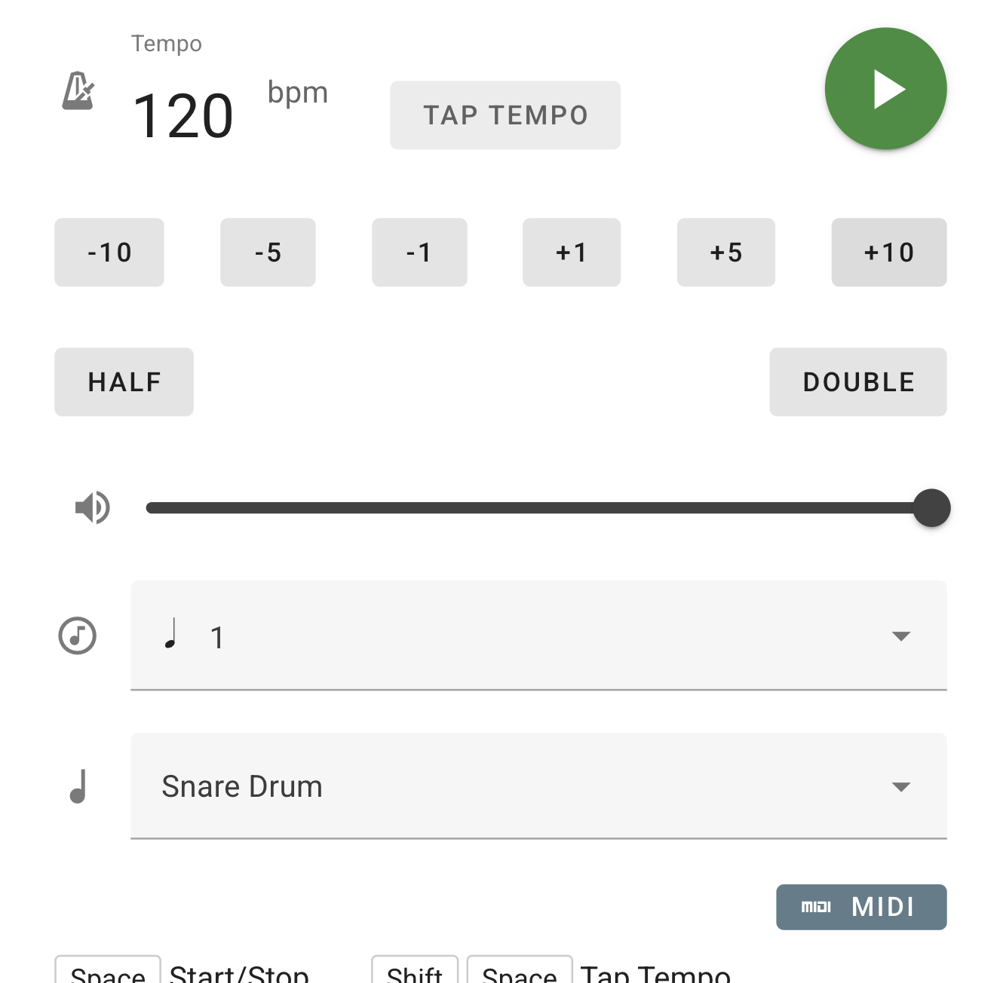

# Metronome

This is a simple metronome using [WebAudioFont](https://github.com/surikov/webaudiofont)

## Overview

This project is a simple metronome application built with WebAudioFont. Its main features are as follows:

- **Sound playback using WebAudioFont**  
  Multiple drum and click sounds (e.g., "Snare Drum", "Bass Drum") are played using WebAudioFont soundfonts.

- **Various rhythm patterns**  
  You can select from a variety of rhythm patterns, such as quarter notes, eighth notes, triplets, and clave rhythms.

- **Tempo and volume control**  
  BPM and volume can be adjusted via the UI or MIDI control change messages.

- **MIDI controller support**  
  You can control tempo, start/stop, and other functions from a MIDI controller.

- **Accurate timing with WebWorker**  
  WebWorker is used to manage timer events, ensuring stable rhythm playback.

- **Settings saved in URL hash**  
  Tempo, rhythm, voice, and other settings are saved in the URL hash, making it easy to reload or share configurations.

- **Visual flash feature**  
  The screen flashes on each beat, providing a visual cue for the rhythm.

- **PWA (Installable App) support**  
  With a web manifest included, this app can be installed to your device as a Progressive Web App (PWA) for offline and standalone use.

All main logic is implemented in `script.js`, including WebAudioFont player/channel setup, soundfont loading, rhythm pattern management, and MIDI integration.
